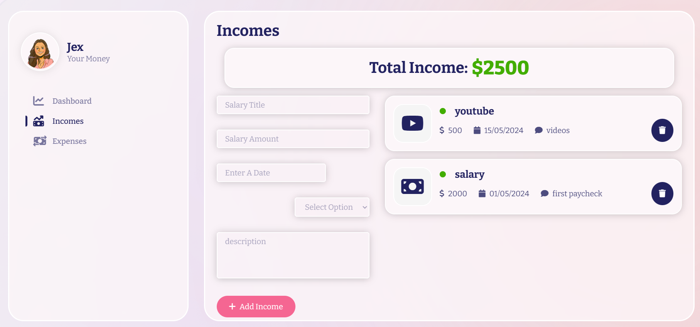
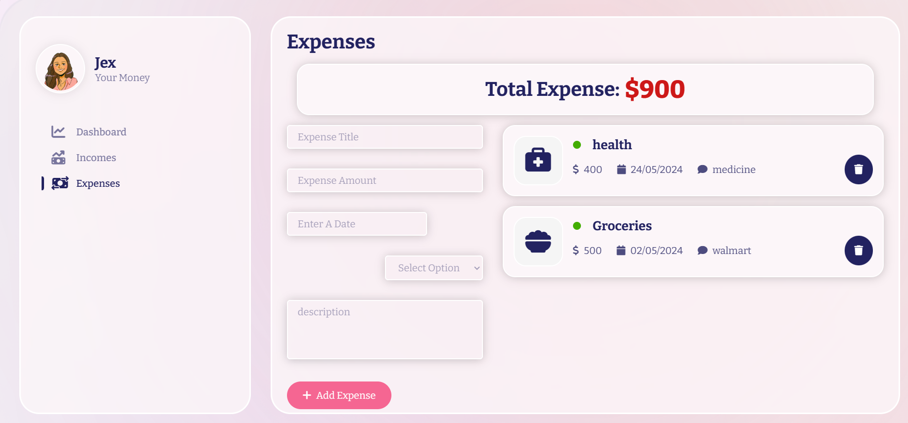

# Expense Tracker 💰

A full-stack personal finance management application that helps you track your income and expenses, visualize spending patterns, and manage your budget effectively.

---

## Features

- **Dashboard** — View total income, total expenses, total balance, and recent transaction history at a glance
- **Income Tracking** — Add and manage income sources with title, amount, date, category, and description
- **Expense Tracking** — Log expenses by category with full details
- **Interactive Chart** — Visual comparison of income vs expenses over time
- **Transaction History** — Chronological list of all recent transactions
- **Min/Max Salary & Expense Stats** — Instantly see your highest and lowest transactions

---

## Screenshots

### Dashboard


### Balance Overview


### Income Page


### Expense Page


---

## Tech Stack

**Frontend**
- React.js
- Styled Components
- Chart.js
- Context API (global state management)

**Backend**
- Node.js
- Express.js
- MongoDB (Atlas)
- Mongoose

---

## Getting Started

### Prerequisites
- Node.js installed
- MongoDB Atlas account

### Installation

1. **Clone the repository**
   ```bash
   git clone https://github.com/janvi33/Expense-Tracker.git
   cd Expense-Tracker
   ```

2. **Setup Backend**
   ```bash
   cd Backend
   npm install
   ```
   Create a `.env` file in the `Backend` folder:
   ```
   PORT=5000
   MONGO_URL=your_mongodb_connection_string
   ```
   Start the backend:
   ```bash
   npm start
   ```

3. **Setup Frontend**
   ```bash
   cd frontend/expense-tracker
   npm install
   npm start
   ```

4. Open your browser at `http://localhost:3000`

---

## Project Structure

```
Expense-Tracker/
├── Backend/
│   ├── controllers/
│   │   ├── Expense.js
│   │   └── Income.js
│   ├── db/
│   │   └── db.js
│   ├── models/
│   │   ├── ExpenseModel.js
│   │   └── IncomeModel.js
│   ├── routes/
│   ├── app.js
│   └── .env
└── frontend/
    └── expense-tracker/
        └── src/
            ├── Components/
            ├── context/
            └── utils/
```

---

## API Endpoints

| Method | Endpoint | Description |
|--------|----------|-------------|
| GET | `/api/v1/get-incomes` | Fetch all incomes |
| POST | `/api/v1/add-income` | Add a new income |
| DELETE | `/api/v1/delete-income/:id` | Delete an income |
| GET | `/api/v1/get-expenses` | Fetch all expenses |
| POST | `/api/v1/add-expense` | Add a new expense |
| DELETE | `/api/v1/delete-expense/:id` | Delete an expense |

---

Made by [Janvi](https://github.com/janvi33)
